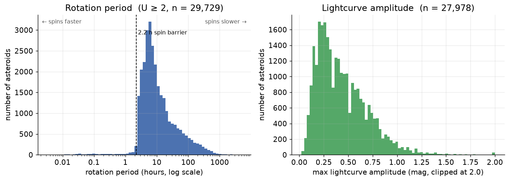
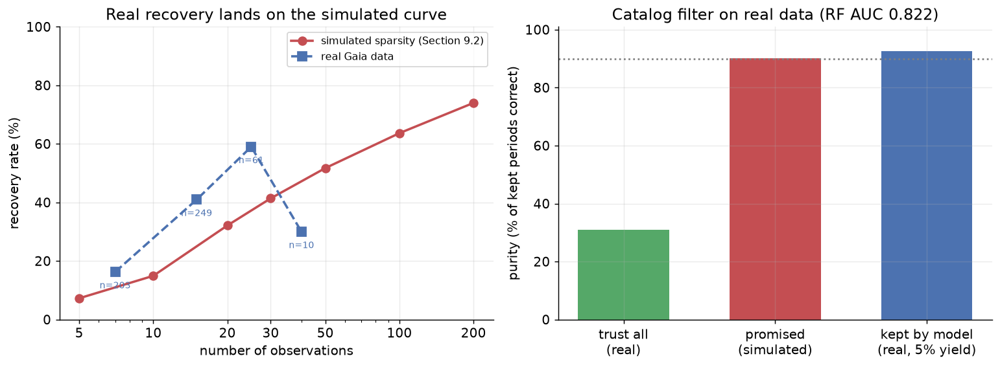

# Recovering Asteroid Rotation Periods from Sparse Light Curves

**Capstone Final Report** — nontechnical summary. The full analysis, with all
figures and code, is in
[`asteroid_rotation_technical.ipynb`](asteroid_rotation_technical.ipynb).

## Problem statement

Every asteroid spins, and how fast it spins reveals what it is made of: a solid
chunk of rock can spin arbitrarily fast, but a loosely-bound "rubble pile" flying
apart at the seams cannot complete a rotation faster than about once per 2.2
hours. Measuring rotation periods at scale is therefore one of the main windows
into what asteroids are — with obvious scientific and planetary-defense value.

The traditional way to measure a period is to watch one asteroid all night with a
dedicated telescope. That does not scale: the Rubin Observatory is about to
increase the number of known asteroids several-fold, but it will observe each one
only a handful of times — **sparse** data, far below what traditional methods
need. The classical algorithm for sparse data (the Lomb–Scargle periodogram)
returns a period for every object but, in the sparse regime, most of those
periods are wrong in a specific, structured way: the observing cadence itself
manufactures convincing false periods ("aliases").

**The goal of this project:** a machine-learning model that looks at a sparse
light curve and its candidate period and judges — reliably enough to build a
trustworthy catalog — whether that period is real or an alias.

## Model outcomes and predictions

This is **supervised binary classification**. The model's output is a
**confidence score (0 to 1) that a candidate rotation period is correct**. Setting
a threshold on that score filters the flood of automated period estimates into a
smaller catalog whose error rate is controlled — the practical product a survey
pipeline needs. (An unsupervised approach was never appropriate here: thousands
of asteroids have published, vetted periods that serve as ground-truth labels.)

## Data acquisition

| Source | Role | Scale |
| --- | --- | --- |
| **LCDB** (Asteroid Lightcurve Database) | Ground-truth labels: published periods with reliability grades | ~36,000 asteroids |
| **ALCDEF** (Asteroid Lightcurve Data Exchange Format) | Dense light curves, the raw material for controlled experiments | 24,643 asteroids |
| **Gaia DR3** + IMCCE Miriade ephemerides | *Real* sparse survey photometry for out-of-sample validation | 569 asteroids used |

Crossing the first two gives **~20,500 asteroids** with both a trustworthy label
and a light curve; 12,785 are dense enough to down-sample. The key experimental
idea — **controlled sparsity** — is to take a dense curve whose period is known
and progressively delete observations, so that "how does accuracy degrade with
sparsity?" can be answered exactly:



## Data preprocessing / preparation

- **Label quality filtering**: only periods with LCDB reliability grade U ≥ 2 are
  used — training on wrong answers teaches wrong answers.
- **Photometric calibration**: each observing session's magnitude zero-point is
  removed, and outliers are rejected with a robust (median-based) cut.
- **Controlled down-sampling**: each dense curve is reduced to 200 / 100 / 50 /
  30 / 20 / 10 / 5 observations, spread across nights the way real survey visits
  are.
- **Train/test splitting by asteroid, never by row**: the same asteroid at
  different sparsity levels always stays on one side of the split, so the model
  is only ever scored on objects it has never seen — preventing the subtle
  leakage that would inflate every number.
- **Real Gaia data** required one extra step: over months, an asteroid's apparent
  brightness is dominated by its changing distance from Earth and Sun. Each
  measurement is corrected by subtracting the predicted brightness from an
  ephemeris service, leaving only the rotation signal. The correction validates
  itself: the resulting variation amplitudes match the published catalog to a
  hundredth of a magnitude.

## Modeling

Models were compared on identical held-out asteroids at every step:

1. **Lomb–Scargle periodogram** — the classical, non-ML baseline every model
   must beat.
2. **Logistic regression** — the simplest learned reference point.
3. **Random forest** on 14 hand-crafted features describing how the curve was
   sampled, how its brightness varies, and what its periodogram looks like.
4. **Gradient-boosted trees** — a stronger learner on the same features, tuned
   by grid search under 5-fold cross-validation (folds grouped by asteroid).
5. **Two neural networks** reading raw data instead of features: a recurrent
   network (GRU) reading the observation sequence folded at the candidate
   period, and a convolutional network reading the entire periodogram.

## Model evaluation

The headline metric is **ROC-AUC**: pick one correct period and one alias at
random — how often does the model score the correct one higher? It is chosen
because the task is to *rank* period estimates by trustworthiness so a cutoff
can be set afterwards; it is threshold-independent and robust to class
imbalance. The practical companion metrics are **purity** (of the periods kept,
how many are right) and **yield** (how many objects are kept at all).

**Results on identical held-out asteroids (simulated sparsity):**

| Model | ROC-AUC |
| --- | --- |
| **Random forest (14 features)** | **0.899** |
| Gradient-boosted trees (tuned) | 0.900 (statistical tie) |
| GRU on raw folded curves | 0.882 |
| CNN on full periodograms | 0.876 |
| Logistic regression | 0.871 |
| LS false-alarm probability alone | 0.833 |
| LS peak power alone | 0.406 — *worse than random* |

Three findings give the numbers their meaning. First, the gradient-boosted tie
means the **model class was never the bottleneck** — the features and training
size set the ceiling. Second, the networks came close overall but split the map:
the forest wins wherever data is moderate or dense, while **the folded-curve
network wins the sparsest regime** (at 5 observations: 0.753 vs 0.709) — the one
place the survey use case needs help most. Third, raw periodogram peak height
being *worse than random* confirms the core danger of sparse data: with few
points, any period fits well.

**The payoff**, filtered through the forest's confidence score: a catalog that is
**90% pure while keeping 28% of objects**, versus 40% purity from trusting
Lomb–Scargle outright.

**Validation on real survey data.** Everything above uses simulated sparsity, so
the model was finally tested — unchanged, no retraining — on 569 asteroids with
genuine Gaia DR3 sparse photometry:



Real recovery rates land on the simulated curve (the simulation was faithful),
and the model still ranks reliably (AUC 0.82). One honest caveat: at the
pre-committed confidence threshold the kept periods are even purer than promised
(93%) but far fewer objects are kept (5% vs 28%) — the model is systematically
under-confident on data that looks slightly different from its training
distribution. The ranking transfers; the threshold needs recalibrating on a
small labeled real sample.

## Findings at a glance

- Classical period-finding collapses on sparse data (74% → 7% recovery from 200
  down to 5 observations), and its own confidence signals cannot be trusted.
- A random forest on 14 physically-motivated features judges period reliability
  at AUC 0.899 and turns a 40%-pure output into a 90%-pure catalog at 28% yield.
- Neither stronger learners (gradient boosting: tie) nor raw-data neural
  networks (0.876–0.882) beat those features overall — but folded-curve networks
  win in the sparsest regime, pointing at the next model.
- The whole pipeline transfers to real Gaia data: faithful simulation, reliable
  ranking (AUC 0.82), purity promise exceeded — with threshold recalibration as
  the one missing piece for deployment.

## Next steps and recommendations

1. **Candidate re-ranking** — score several periodogram peaks per object, not
   just the tallest, so the model can *recover* periods the classical method
   misranks rather than only filtering them.
2. **A hybrid model** — hand-crafted features plus a folded-curve encoder in one
   model, uniting each one's strong regime.
3. **Recalibrate on real data, and add ZTF** — a small labeled Gaia sample fixes
   the threshold; `scripts/fetch_survey_data.py` already supports ZTF for when
   its data service is reachable.
4. **Scale training** to the full 12,785-object dense pool with multiple sparse
   realizations per object.

## Repository structure

```
asteroid_rotation_technical.ipynb   # full technical report (all analysis + figures)
requirements.txt
src/
  data_loading.py     # parse LCDB labels + ALCDEF light curves
  sparsity.py         # controlled down-sampling pipeline
  baseline.py         # Lomb–Scargle periodogram baseline
  features.py         # feature extraction for the classifier
  neural.py           # neural-net experiments (GRU on folded curves, CNN on periodograms)
  surveys.py          # Gaia DR3 photometric reduction for real-data validation
scripts/
  download_data.sh       # download + lay out the raw data under data/raw/
  build_features.py      # build data/processed/features.parquet (and coverage cache)
  build_baseline.py      # build the cached Lomb–Scargle baseline sweep
  fetch_survey_data.py   # fetch real survey photometry (Gaia DR3 + ZTF) + ephemerides
data/                 # raw/interim/processed (git-ignored; rebuilt by the scripts)
figures/              # saved figures used in the report
docs/                 # capstone overview, proposal, unit requirements, rubric
```

## Reproducing

```bash
# environment (conda; the scientific stack from conda-forge, torch via pip)
conda create -n asteroid-lc -c conda-forge -y python=3.12 \
  numpy pandas scipy matplotlib seaborn astropy scikit-learn pyarrow jupyter
conda activate asteroid-lc
pip install torch requests   # neural-net experiments (CPU build is sufficient)

# raw data (git-ignored; ~140 MB): LCDB labels + ALCDEF light curves
bash scripts/download_data.sh

# feature table: 2,000 sampled asteroids x 7 sparsity levels (~10-30 min)
python scripts/build_features.py

# real survey data for Section 13 (Gaia DR3 + Miriade ephemerides; resumable)
python scripts/fetch_survey_data.py

jupyter notebook asteroid_rotation_technical.ipynb
```
